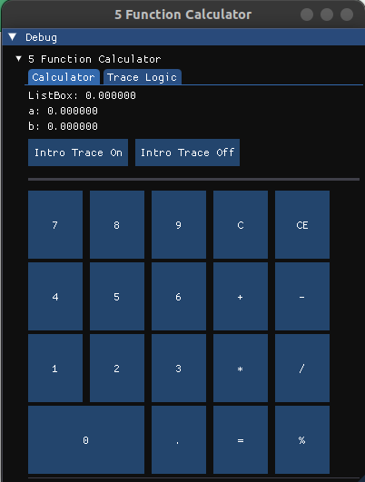
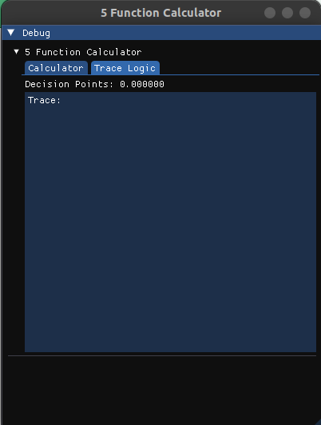
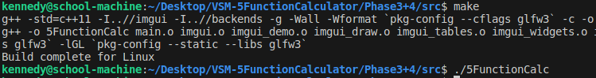

# 5 Function Calculator by Kennedy Ford

## Description
This is a program that creates a 5 Function Calculator written in C++ and using the ImGui GUI Library
under the framework of OpenGLFW. The five functions are addition, subtractions (which is used as both subtraction and denoting a negative number), multiplication, division, and an additive tax calculation (denoted by %).

The program also traces both the inputs by the user as well as the internal logic of the program and the binary decisions that the program makes for analysis and debugging. Also, to assist in the understanding of what is happening under the hood so to speak.

 
 

## How to Build
This project was developed on a machine running `Linux Ubuntu 22.04`, so it is intended for Linux.
ImGui and OpenGLFW have the capability to cross compile, but this has yet to test this at the time of 
writing this document. For the time being, this section will describe the Linux compilation.

### Changing the Code and/or Build the Executable
If you want to edit this file, open the `/Phase3+4/src/main.cpp/` file. This is where all of the code is written. All of the other files are to run the ImGui library and to build the executable. Then, when you want to build the project with your newly created changes, run the command `make` to build the project.

### Run the Executable
To run this project, either double click the `5FunctionCalc` file, or open a terminal, navigate to the directry where the executable is located, and execute the following command `./5FunctionCalc`

 

## Methodology / Implementation
This is a project given by VS Merlot for use in analyzing techical skills. I was given this project on Feb. 12th, 2024 and given a week to complete it. My approach to the project is shown some within the names of the directories, but I will further expound on them here. Please see the files within each directory for more context as to the work that I did.

### Phase 1: Research
Most of these tools, including C++, ImGui, and OpenGLFW, I had never used before. So, the first thing I did is research.
I began researching details about C++ and the frameworks that I selected, and I began diving into the handout that I was given.
I quickly saw many questions that I had regarding this document and forwarded them to my contact for clarification.
Once I felt moderately comfortable with C++, which didn't take overly long, I got to work.

### Phase 2: Logic Implementation
I decided to not focus on the GUI at first and to get the core logic of the 5 functions working as intended. Beyond this, I also wanted to get the general logic of each of the buttons functional via command line.
I did most of this in one evening. Since I was waiting on some of my answers regarding the document, I decided to have a little bit of fun by creating a text-based calculator to display the ListBox value in.
By the time I finished that, I stopped working on it for the day. I also received a response to my questions by then, so I read over the answers and began working on figuing out the GUI framework the next day.

### Phase 3: GUI Visualization
This part was probably one of the most difficult sections. It took me a good while to get used to building the GUI. Building the GUI wasn't really the hardest part. The main issue was getting the logic to cooperate within the GUI.
This part took me a few days to get right, but finally I was able to get the calculator visually and logically to a place stability and accuracy wise where I felt good about it.

### Phase 4: Logic Trace Finalization
This part was also somewhat difficult, especially in deciding what the best way to display everything was using the tools that the GUI gave me.
Overall, I'm not sure if I really got everything that was required of me. I think I got most of the relevant information, but I may be missing something that they are looking for.
Nevertheless, there might be one or two issues that I haven't found yet, but overall I am satisfied with my production of the deliverable.

### Phase 5: Documentation + Final Thoughts (comments, etc.)
This has been a continuous process, but documenting everything that I have done, through both this as well as comments, is something that I have put a lot of effort into.
One thing that I believe that makes me a good fit for this company is that I think that I know what they are looking for. They aren't just looking for a good programmer. There are plenty of those, but
more than that, they need someone who can effectively communicate technical ideas, decisions, and the value of said decisions. Not only the what, but the why, and why that 'why' is valuable. 

  

## Conclusion + Why you should hire me (humbly)
If my analysis from the previous paragraph correct, then I do believe that I shine far above most candidates. I am not only an adept programmer, but I am an excellent communication, especially in regards to technological ideas.
This company needs software engineers that can give presentations on their work to people who may not have a technological background and explain the value of Temporal Engineering. It needs software engineers who can explain
ideas that they themselves are helping to define and create, especially to the military for any government contracts that the company may be aiming for. This is literally what I have been doing for the last two years. 
I have been explaining the value of new technology that I and my team have been building, things that have never been done before, to very high ranking members of the government and military. Even beyond the military/government, 
explaining not only the what, but the why, the value, to business executives and companies. I believe that I am the person who can do that. Who can go to bat for this company. Who can help keep the ship afloat while we build this legacy. 
This is what I believe that I bring to the table that many other candidates do not.

Thank you for considering me for this position. I am beyond grateful. Truly.

Kennedy
